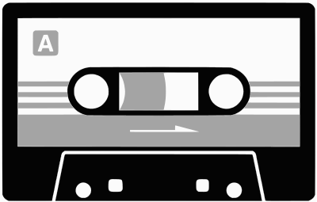

I'm @`kandr3s`, a Colombian programmer that lives a minimalist life, owning only essential stuff and using open source [tools](/tools). 

I studied journalism and computer science but haven't received a college degree. I've worked in gold mines, retail, warehouses, call centers, online publications and writing code. I consider myself an autodidact as I've become this person thanks to curiosity, love for learning and being fortunate enough to have grown up with a screen connected to the Internet.

I'm not an active social media user so this website aims to be my <a href="/feed.xml" alt="kandr3s RSS Feed" title="kandr3s RSS Feed">main channel</a> for [**communicating**](/now){: title="/Now Page"} with the world online. This is my personal space on the Web, the place for me to share [**thoughts**](#posts) and ideas, [**books**](/books) read, loved [**films**](/films) and life-changing [**music**](/music).

Write to me at <a href="mailto:hello@kandr3s.co">`hello`@`kandr3s.co`</a> or follow me elsewhere on:

<ul class="menu">
    <li class="page-link"><a href="/spotify">Spotify</a></li>
    <li class="page-link"><a href="/letterboxd">Letterboxd</a></li>
    <li class="page-link"><a href="/rym">RateYourMusic</a></li>
    <!--li class="page-link"><a href="/mixcloud">Mixcloud</a></li-->
</ul>

<h2 id="posts" class="content-title">Posts</h2>

    <i class="fab fa-microblog"></i>Blog
    <i class="far fa-images"></i>Photos
    <i class="fab fa-spotify"></i>Playlists
    <i class="fas fa-video"></i>Video 
    Tales
    Tinta en las Cintas



<a class="post-title-link external" href="{{ post.external_url }}" target="_blank"><a class="post-title-link" href="{{ post.url }}">{{ post.title }}</a>
    


